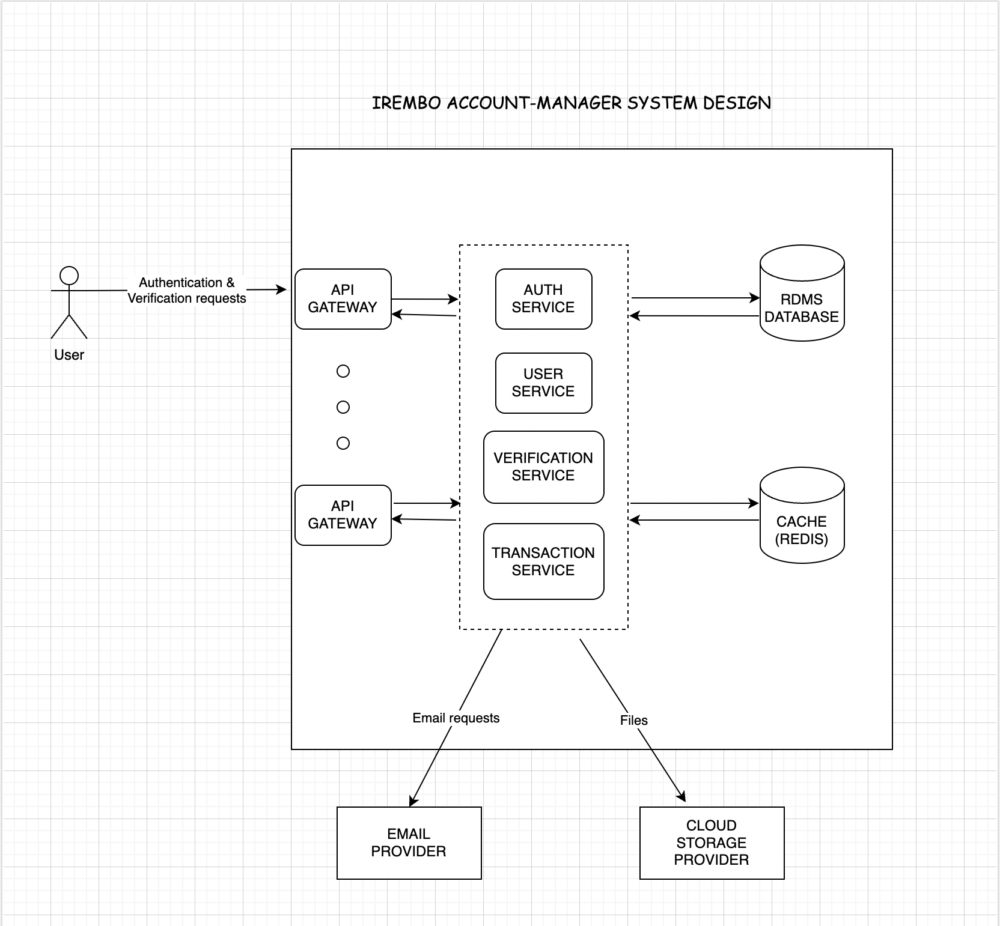
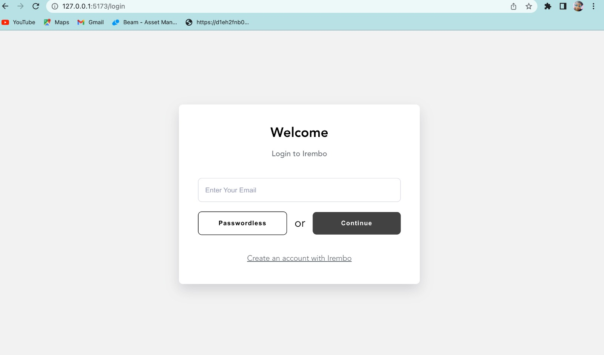
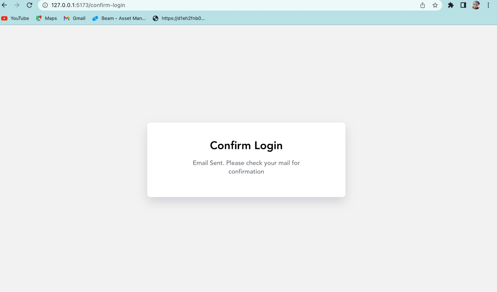
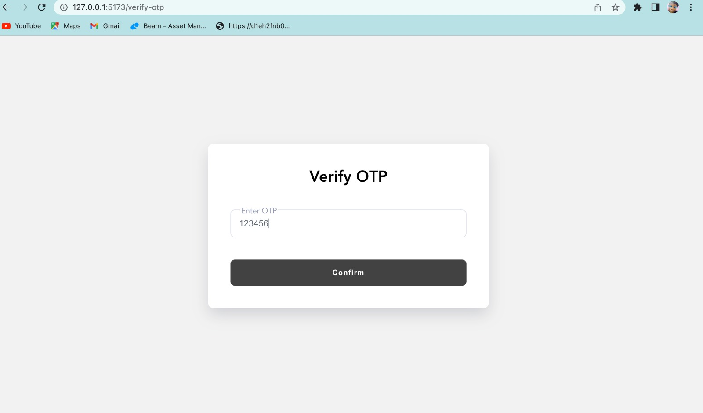
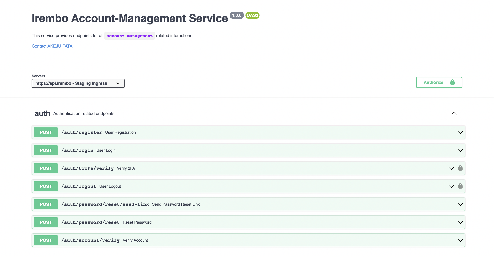
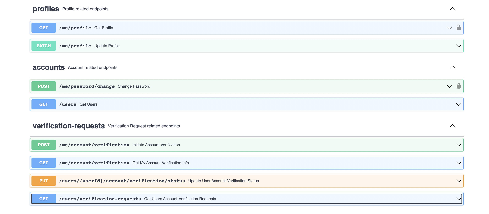

# irembo-account-manager
Irembo account-management assessment

## PROBLEM STATEMENT
```
User Account Management
```

## TOOLS USED
- NodeJs (Express)
- Typescript (Programming language)
- MongoDB (NoSQL database)
- Redis (Caching)
- Docker
- OpenApi & Postman
- Supertest & Jest (Testing)
- React (Front-end)
- Cloudinary (Cloud Storage)
- Nodemailer (Sending emails)

## SYSTEM DESIGN


## UI DISPLAY





## HOW TO RUN THE BACK-END APP 
- Clone github repository
- Install NPM dependencies using `npm install`
- Add `.env` file update variables using `sample.env` template
- Run app using `npm run dev`
- NOTE: For DOCKER, update `Docker.env` file & execute `docker-compose up`

## ASSUMPTIONS
- N/A

## OPTIMIZATIONS
- N/A

## IMPROVEMENTS
- API Versioning

## API-SPEC DISPLAY
```
API documentation (reference `/server/spec/api-spec.yml`)
```


